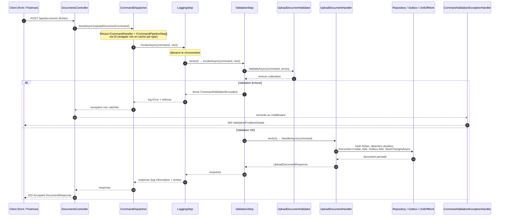

# ADR-012 — Remplacement de MediatR par un CQRS maison basé sur la composition

**Date :** 2026-07-11  
**Statut :** Accepté  
**Auteur :** Geoffrey

---

## Contexte

Depuis Step 1, les commandes d'écriture (upload, suppression, ingestion, transcription vidéo,
ré-embedding) transitaient par **MediatR** : `IRequest<T>` / `IRequestHandler<T,TResponse>` +
un unique `IPipelineBehavior` (`ValidationBehavior`) exécutant les validateurs **FluentValidation**
enregistrés pour la commande.

Un audit de l'usage réel a montré que cette dépendance était largement sous-exploitée :

- **6 commandes, 6 handlers, 1 seul validateur** (`UploadDocumentValidator`) sur l'ensemble du
  projet — les 5 autres commandes n'avaient aucune règle de validation.
- **Un seul behavior actif** ; `LoggingBehavior` et `PerformanceBehavior` étaient commentés dans
  le DI depuis le début, jamais implémentés.
- **Aucun** `INotification` ni `IStreamRequest` utilisé — uniquement le dispatch commande→handler.
- MediatR 14 est passé sous **licence commerciale**, ce qui pèse pour un usage aussi restreint.

L'audit a aussi mis au jour une **dette existante** : `ValidationBehavior` levait une
`FluentValidation.ValidationException`, mais celle-ci n'était interceptée **nulle part** côté
`Web.Api` — une commande invalide remontait donc en `500` au lieu d'une `400` exploitable par
le front.

L'objectif est de remplacer MediatR par une solution maison, **basée sur la composition plutôt
que l'héritage**, pour que chaque préoccupation transverse (validation, journalisation, et
celles à venir) reste une brique indépendante et testable, sans toucher aux handlers existants
à chaque ajout.

---

## Décision

Adopter un mini-framework CQRS interne (`AIExperience.Rag.Application/Common/Cqrs/`) organisé
comme une **chaîne de maillons composés** autour d'un handler « pur » — le même modèle qu'un
pipeline de middlewares ASP.NET Core, et in fine celui que MediatR reconstruit lui-même en
interne.

### Contrats

| Élément | Rôle | Remplace |
|---|---|---|
| `ICommand<TResponse>` | Marque une commande d'écriture | `IRequest<T>` |
| `ICommandHandler<TCommand,TResponse>` | Logique métier pure, sans préoccupation transverse | `IRequestHandler<T,R>` |
| `ICommandPipelineStep<TCommand,TResponse>` | Maillon transverse composé autour du handler | `IPipelineBehavior<,>` |
| `ICommandValidator<TCommand>` | Règles de validation d'une commande | `AbstractValidator<T>` |
| `ICommandDispatcher` | Point d'entrée d'envoi (résout handler + compose la chaîne) | `ISender` |
| `ValidationErrors` / `ValidationError` | Collecteur d'erreurs minimal | API FluentValidation |
| `CommandValidationException` | Levée si la validation échoue | `ValidationException` |

### Deux maillons livrés par défaut

- **`ValidationStep<TCommand,TResponse>`** — exécute tous les `ICommandValidator<TCommand>`
  enregistrés ; lève `CommandValidationException` si au moins une règle échoue, sans jamais
  appeler le maillon suivant.
- **`LoggingStep<TCommand,TResponse>`** — chronomètre l'ensemble de la chaîne et journalise
  l'issue (`Information` en succès, `Error` en échec — hors `OperationCanceledException`, qui
  n'est pas un échec métier).

### Ordre de composition — le point d'attention

`AddCqrs()` enregistre `LoggingStep` **avant** `ValidationStep` : le premier enregistré est le
plus externe. `Logging` enveloppe donc `Validation`, et voit passer ses échecs — un point
vérifié explicitement par un test dédié (`AddCqrs_ValidationFails_LoggingStepStillLogsTheError`).

### Le dispatcher

`CommandDispatcher` résout le handler et les maillons via DI au moment de l'appel, sans les
connaître à la compilation. La fermeture du type générique par réflexion (coûteuse) n'est faite
qu'une fois par type de commande, puis mise en cache (`ConcurrentDictionary`) — même technique
que celle employée par MediatR en interne.

### Correction de la dette de validation

`CommandValidationExceptionHandler` (`IExceptionHandler`, `Web.Api/ExceptionHandling/`) traduit
désormais une `CommandValidationException` en **400 `ValidationProblemDetails`**, câblé via
`AddExceptionHandler<T>()` + `UseExceptionHandler()` dans `Program.cs`.

---

## Architecture de la solution

### Hiérarchie d'appel, du contrôleur à la réponse

Illustrée avec `UploadDocumentCommand` — le seul cas qui active tous les maillons, validation
incluse. Les 5 autres commandes suivent le même chemin sans la boîte `Rules` : aucune n'a de
`ICommandValidator` enregistré, `ValidationStep` les traverse alors sans coût.



### Enregistrement DI (`AddCqrs`)

```csharp
public static IServiceCollection AddCqrs(this IServiceCollection services, Assembly assembly)
{
    services.AddScoped<ICommandDispatcher, CommandDispatcher>();

    // L'ordre d'ENREGISTREMENT définit l'ordre d'EXÉCUTION : le premier enregistré est le plus externe.
    services.AddScoped(typeof(ICommandPipelineStep<,>), typeof(LoggingStep<,>));
    services.AddScoped(typeof(ICommandPipelineStep<,>), typeof(ValidationStep<,>));

    RegisterImplementationsOf(services, assembly, typeof(ICommandHandler<,>));
    RegisterImplementationsOf(services, assembly, typeof(ICommandValidator<>));
    return services;
}
```

Un maillon peut aussi cibler **une seule commande** en s'enregistrant en générique fermé
(`services.AddScoped<ICommandPipelineStep<DeleteDocumentCommand, bool>, AuditDeletionStep>();`) —
impossible à faire proprement avec un Template Method sans toucher à la hiérarchie de classes.

---

## Conséquences

### Positives

- **Ouvert/fermé** : un nouveau souci transverse (transaction, retry, audit ciblé) = un nouveau
  maillon enregistré dans `AddCqrs`, sans modifier un seul handler existant.
- **Testabilité** : chaque maillon se teste isolément avec un `next` factice (22 tests sur le
  socle) ; les handlers se testent sans aucune machinerie transverse.
- **Dette corrigée** : une commande invalide renvoie enfin `400` au lieu de `500`.
- **Dépendance retirée** : `MediatR` et `FluentValidation` supprimés des `.csproj` — plus
  d'exposition à la licence commerciale de MediatR 14 pour un usage qui n'en exploitait qu'une
  fraction.
- Migration mécanique et à faible risque : le corps de chaque handler n'a pas changé (seuls
  l'interface implémentée et le nom de la méthode ont bougé), confirmé par la suite de tests
  existante (265/265 verts après migration).

### Négatives / points d'attention

- **Ordre implicite** : l'ordre d'exécution des maillons vit dans l'ordre d'enregistrement DI,
  moins visible qu'une méthode scellée qui déroule des étapes nommées. Documenté en commentaire
  directement dans `AddCqrs()`.
- **Un peu plus de plomberie** qu'un Template Method (deux classes de maillons + le dispatcher),
  compensé par la flexibilité de composition — voir alternatives rejetées ci-dessous.
- Le test unitaire de `CommandValidationExceptionHandler` nécessite une référence de
  `AIExperience.Tests` vers `AIExperience.Web.Api` ; à ajouter lors d'une prochaine session
  (bloqué ponctuellement par une session de debug Visual Studio verrouillant le dossier de
  build de `Web.Api`).

---

## Alternatives rejetées

| Alternative | Raison du rejet |
|-------------|-----------------|
| Conserver MediatR | Dépendance commerciale (v14) pour un usage minimal (1 behavior, 1 validateur sur 6 commandes) ; aucun bénéfice de `INotification`/streaming exploité. |
| Template Method (`CommandHandlerBase` scellant Validation → Exécution → Finalisation) | Chaque nouveau souci transverse oblige à toucher la classe de base ou à en dériver ; un maillon ciblé sur une seule commande impossible sans complexifier la hiérarchie. Rejeté après discussion explicite en faveur de la composition. |
| Garder FluentValidation, retirer seulement MediatR | Aurait laissé une dépendance externe pour une seule classe de règles (`UploadDocumentValidator`) ; `ValidationErrors` maison couvre le même besoin sans dépendance. |
| Ne rien changer (statu quo) | Ne corrige pas la dette de validation (500 au lieu de 400) et maintient l'exposition à la licence MediatR. |
